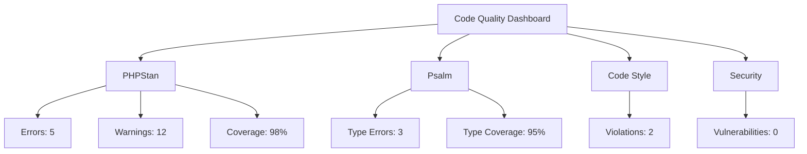

# Plano para Configuração de Análise de Código Estática

## 📋 **Visão Geral**

Implementar análise de código estática robusta para garantir qualidade, segurança e consistência do código do Coyote Framework.

## 🎯 **Objetivos**

1. **Detectar bugs potenciais** antes da execução
2. **Garantir qualidade de código** com padrões consistentes
3. **Identificar vulnerabilidades** de segurança
4. **Melhorar manutenibilidade** do código
5. **Integrar análise** no CI/CD pipeline

## 🛠️ **Ferramentas de Análise**

### **1. PHPStan (Análise Estática)**
```bash
# Instalação
composer require --dev phpstan/phpstan

# Configuração básica
vendor/bin/phpstan analyse src --level=max
```

### **2. Psalm (Análise de Tipos)**
```bash
# Instalação
composer require --dev vimeo/psalm

# Configuração inicial
vendor/bin/psalm --init
```

### **3. PHP CS Fixer (Code Style)**
```bash
# Instalação
composer require --dev friendsofphp/php-cs-fixer

# Configuração
vendor/bin/php-cs-fixer fix src --rules=@PSR12
```

### **4. PHP CodeSniffer (Code Standards)**
```bash
# Instalação
composer require --dev squizlabs/php_codesniffer

# Verificação
vendor/bin/phpcs src --standard=PSR12
```

### **5. Security Checker**
```bash
# Instalação
composer require --dev enlightn/security-checker

# Verificação de vulnerabilidades
vendor/bin/security-checker security:check
```

## 📊 **Configuração por Ferramenta**

### **PHPStan Configuration**
```neon
# phpstan.neon
parameters:
    level: max
    paths:
        - src
    excludePaths:
        - src/Support/Autoloader.php  # Temporariamente excluído
    checkMissingIterableValueType: false
    reportUnmatchedIgnoredErrors: false
    
    # Análise avançada
    checkGenericClassInNonGenericObjectType: false
    inferPrivatePropertyTypeFromConstructor: true
    
    # Ignorar erros específicos
    ignoreErrors:
        - '#Parameter \#1 \$[a-zA-Z0-9_]+ of method [a-zA-Z0-9_\\]+::[a-zA-Z0-9_]+\(\) expects [a-zA-Z0-9_\\]+, [a-zA-Z0-9_\\]+ given.#'
    
includes:
    - phpstan-baseline.neon
```

### **Psalm Configuration**
```xml
<!-- psalm.xml -->
<?xml version="1.0"?>
<psalm
    errorLevel="2"
    resolveFromConfigFile="true"
    xmlns:xsi="http://www.w3.org/2001/XMLSchema-instance"
    xmlns="https://getpsalm.org/schema/config"
    xsi:schemaLocation="https://getpsalm.org/schema/config vendor/vimeo/psalm/config.xsd"
>
    <projectFiles>
        <directory name="src" />
        <ignoreFiles>
            <directory name="vendor" />
        </ignoreFiles>
    </projectFiles>
    
    <issueHandlers>
        <LessSpecificReturnType errorLevel="info" />
        <MissingConstructor errorLevel="info" />
    </issueHandlers>
    
    <plugins>
        <pluginClass class="Psalm\PhpUnitPlugin\Plugin" />
    </plugins>
</psalm>
```

### **PHP CS Fixer Configuration**
```php
// .php-cs-fixer.php
<?php

$finder = PhpCsFixer\Finder::create()
    ->in(__DIR__)
    ->exclude('vendor')
    ->exclude('node_modules')
    ->name('*.php')
    ->ignoreDotFiles(true)
    ->ignoreVCS(true);

return PhpCsFixer\Config::create()
    ->setRules([
        '@PSR12' => true,
        'array_syntax' => ['syntax' => 'short'],
        'binary_operator_spaces' => [
            'default' => 'single_space',
            'operators' => ['=>' => null]
        ],
        'blank_line_after_namespace' => true,
        'blank_line_after_opening_tag' => true,
        'braces' => [
            'allow_single_line_closure' => true,
        ],
        'cast_spaces' => true,
        'class_definition' => [
            'single_line' => true,
        ],
        'concat_space' => [
            'spacing' => 'none',
        ],
        'declare_equal_normalize' => true,
        'function_typehint_space' => true,
        'include' => true,
        'lowercase_cast' => true,
        'native_function_casing' => true,
        'new_with_braces' => true,
        'no_blank_lines_after_class_opening' => true,
        'no_blank_lines_after_phpdoc' => true,
        'no_empty_statement' => true,
        'no_extra_blank_lines' => true,
        'no_leading_import_slash' => true,
        'no_leading_namespace_whitespace' => true,
        'no_mixed_echo_print' => [
            'use' => 'echo',
        ],
        'no_multiline_whitespace_around_double_arrow' => true,
        'no_short_bool_cast' => true,
        'no_singleline_whitespace_before_semicolons' => true,
        'no_trailing_comma_in_singleline_array' => true,
        'no_unneeded_control_parentheses' => true,
        'no_unused_imports' => true,
        'no_whitespace_before_comma_in_array' => true,
        'no_whitespace_in_blank_line' => true,
        'normalize_index_brace' => true,
        'object_operator_without_whitespace' => true,
        'phpdoc_indent' => true,
        'phpdoc_no_access' => true,
        'phpdoc_no_package' => true,
        'phpdoc_no_useless_inheritdoc' => true,
        'phpdoc_scalar' => true,
        'phpdoc_single_line_var_spacing' => true,
        'phpdoc_summary' => true,
        'phpdoc_to_comment' => true,
        'phpdoc_trim' => true,
        'phpdoc_types' => true,
        'phpdoc_var_without_name' => true,
        'self_accessor' => true,
        'short_scalar_cast' => true,
        'single_blank_line_before_namespace' => true,
        'single_class_element_per_statement' => true,
        'single_line_comment_style' => [
            'comment_types' => ['hash'],
        ],
        'single_quote' => true,
        'space_after_semicolon' => true,
        'standardize_not_equals' => true,
        'ternary_operator_spaces' => true,
        'trailing_comma_in_multiline' => true,
        'trim_array_spaces' => true,
        'unary_operator_spaces' => true,
        'whitespace_after_comma' => true,
    ])
    ->setFinder($finder);
```

## 📈 **Plano de Implementação por Fase**

### **Fase 1: Configuração Básica (1 semana)**
1. Instalar e configurar PHPStan nível 5
2. Configurar baseline para erros existentes
3. Integrar no CI/CD pipeline
4. Documentar processo para desenvolvedores

### **Fase 2: Análise Avançada (2 semanas)**
1. Configurar Psalm para análise de tipos
2. Implementar análise de segurança
3. Configurar análise de complexidade
4. Adicionar análise de dead code

### **Fase 3: Code Style (1 semana)**
1. Configurar PHP CS Fixer com regras PSR-12
2. Configurar PHP CodeSniffer
3. Criar pre-commit hooks
4. Integrar com editor/IDE

### **Fase 4: Integração Completa (1 semana)**
1. Configurar GitHub Actions para análise
2. Criar relatórios automatizados
3. Configurar notificações
4. Documentar resultados e métricas

### **Fase 5: Manutenção Contínua (contínua)**
1. Revisar e atualizar configurações
2. Analisar novos tipos de erros
3. Otimizar performance da análise
4. Treinar desenvolvedores

## 🔄 **Integração com CI/CD**

### **GitHub Actions Workflow**
```yaml
# .github/workflows/static-analysis.yml
name: Static Analysis

on:
  push:
    branches: [ main, develop ]
  pull_request:
    branches: [ main ]

jobs:
  phpstan:
    runs-on: ubuntu-latest
    steps:
      - uses: actions/checkout@v3
      - name: Setup PHP
        uses: shivammathur/setup-php@v2
        with:
          php-version: '8.3'
          coverage: none
          
      - name: Install dependencies
        run: composer install --prefer-dist --no-progress
        
      - name: Run PHPStan
        run: vendor/bin/phpstan analyse --error-format=github
        
      - name: Upload PHPStan results
        uses: actions/upload-artifact@v3
        if: always()
        with:
          name: phpstan-results
          path: phpstan-report.json
          
  psalm:
    runs-on: ubuntu-latest
    steps:
      - uses: actions/checkout@v3
      - name: Setup PHP
        uses: shivammathur/setup-php@v2
        with:
          php-version: '8.3'
          
      - name: Install dependencies
        run: composer install --prefer-dist --no-progress
        
      - name: Run Psalm
        run: vendor/bin/psalm --output-format=github
        
      - name: Upload Psalm results
        uses: actions/upload-artifact@v3
        if: always()
        with:
          name: psalm-results
          path: psalm-report.json
          
  cs-fixer:
    runs-on: ubuntu-latest
    steps:
      - uses: actions/checkout@v3
      - name: Setup PHP
        uses: shivammathur/setup-php@v2
        with:
          php-version: '8.3'
          
      - name: Check code style
        run: vendor/bin/php-cs-fixer fix --dry-run --diff
        
  security:
    runs-on: ubuntu-latest
    steps:
      - uses: actions/checkout@v3
      - name: Security check
        run: vendor/bin/security-checker security:check
```

### **Pre-commit Hooks**
```bash
#!/bin/bash
# .githooks/pre-commit

# Executar análise estática antes do commit
echo "Running static analysis..."

# PHPStan
vendor/bin/phpstan analyse src --no-progress

if [ $? -ne 0 ]; then
    echo "PHPStan failed. Please fix errors before committing."
    exit 1
fi

# PHP CS Fixer (check only)
vendor/bin/php-cs-fixer fix --dry-run --diff

if [ $? -ne 0 ]; then
    echo "Code style issues found. Run 'composer fix' to fix them."
    exit 1
fi

echo "Static analysis passed!"
exit 0
```

## 📊 **Métricas e Relatórios**

### **Relatório de Qualidade**
```json
{
  "timestamp": "2026-03-30T21:00:00Z",
  "metrics": {
    "phpstan": {
      "errors": 5,
      "warnings": 12,
      "files_analyzed": 165,
      "coverage": "98%"
    },
    "psalm": {
      "errors": 3,
      "info": 8,
      "type_coverage": "95%"
    },
    "code_style": {
      "violations": 2,
      "fixed": 15
    },
    "security": {
      "vulnerabilities": 0,
      "advisories": 1
    }
  },
  "trend": {
    "errors_weekly": -15,
    "coverage_weekly": "+2%",
    "technical_debt": "medium"
  }
}
```

### **Dashboard de Métricas**


## 🧪 **Testes Específicos por Módulo**

### **Core Module Analysis**
```bash
# Análise específica do módulo Core
vendor/bin/phpstan analyse src/Core --level=max
vendor/bin/psalm src/Core
```

### **Security Analysis**
```bash
# Análise de segurança específica
vendor/bin/security-checker security:check
vendor/bin/psalm --taint-analysis
```

### **Performance Analysis**
```bash
# Análise de performance do código
vendor/bin/phpstan analyse --configuration=phpstan-performance.neon
```

## ⚠️ **Riscos e Mitigações**

### **Risco 1: Falsos Positivos**
- **Problema**: Muitos erros falsos positivos
- **Mitigação**: Configurar baseline e ignorar erros conhecidos
- **Solução**: Ajustar configurações gradualmente

### **Risco 2: Performance da Análise**
- **Problema**: Análise muito lenta
- **Mitigação**: Usar cache, analisar incrementalmente
- **Solução**: Paralelizar análise no CI/CD

### **Risco 3: Resistência da Equipe**
- **Problema**: Desenvolvedores não adotam análise
- **Mitigação**: Integrar suavemente, educar benefícios
- **Solução**: Gamificação, métricas visíveis

### **Risco 4: Configuração Complexa**
- **Problema**: Configuração difícil de manter
- **Mitigação**: Documentar claramente, usar templates
- **Solução**: Scripts de configuração automática

## 📅 **Cronograma Detalhado**

| Semana | Fase | Tarefas | Horas |
|--------|------|---------|-------|
| 1 | Configuração Básica | PHPStan, baseline, CI/CD integration | 20 |
| 2-3 | Análise Avançada | Psalm, security analysis, type checking | 30 |
| 4 | Code Style | PHP CS Fixer, CodeSniffer, pre-commit hooks | 20 |
| 5 | Integração Completa | GitHub Actions, reports, notifications | 20 |
| 6 | Otimização | Performance tuning, false positives reduction | 15 |
| **Total** | | | **105 horas** |

## 📚 **Documentação para Desenvolvedores**

### **Guia de Uso**
```markdown
# Static Analysis Guide

## Comandos Disponíveis
```bash
# Análise completa
composer analyse

# Análise específica
composer analyse:phpstan
composer analyse:psalm
composer analyse:cs
composer analyse:security

# Corrigir code style
composer fix

# Gerar baseline (para novos projetos)
composer analyse:baseline
```

## Resolução de Problemas Comuns

### Erro PHPStan: "Method not found"
```php
// Adicionar PHPDoc para ajudar o analisador
/**
 * @method mixed getContainer()
 */
class Application
{
    // ...
}
```

### Erro Psalm: "Type mismatch"
```php
// Especificar tipos de retorno
/**
 * @return array<string, mixed>
 */
public function getConfig(): array
{
    return $this->config;
}
```

### Code Style Issues
```bash
# Verificar problemas
composer cs:check

# Corrigir automaticamente
composer cs:fix
```

## Configuração do IDE
- VS Code: Extensões PHPStan, Psalm
- PHPStorm: Configurar inspections
- Sublime: Pacotes LSP-php
```

### **Composer Scripts**
```json
{
    "scripts": {
        "analyse": [
            "@analyse:phpstan",
            "@analyse:psalm",
            "@analyse:cs",
            "@analyse:security"
        ],
        "analyse:phpstan": "vendor/bin/phpstan analyse",
        "analyse:psalm": "vendor/bin/psalm",
        "analyse:cs": "vendor/bin/php-cs-fixer fix --dry-run --diff",
        "analyse:security": "vendor/bin/security-checker security:check",
        "fix": "vendor/bin/php-cs-fixer fix",
        "cs:check": "@analyse:cs",
        "cs:fix": "@fix"
    }
}
```

## 🔄 **Processo de Melhoria Contínua**

### **Weekly Review Process**
1. Revisar relatórios de análise
2. Identificar padrões de erros
3. Atualizar configurações se necessário
4. Treinar desenvolvedores em áreas problemáticas
5. Atualizar baseline se novos erros forem aceitos

### **Metrics Tracking**
```php
// scripts/track-m