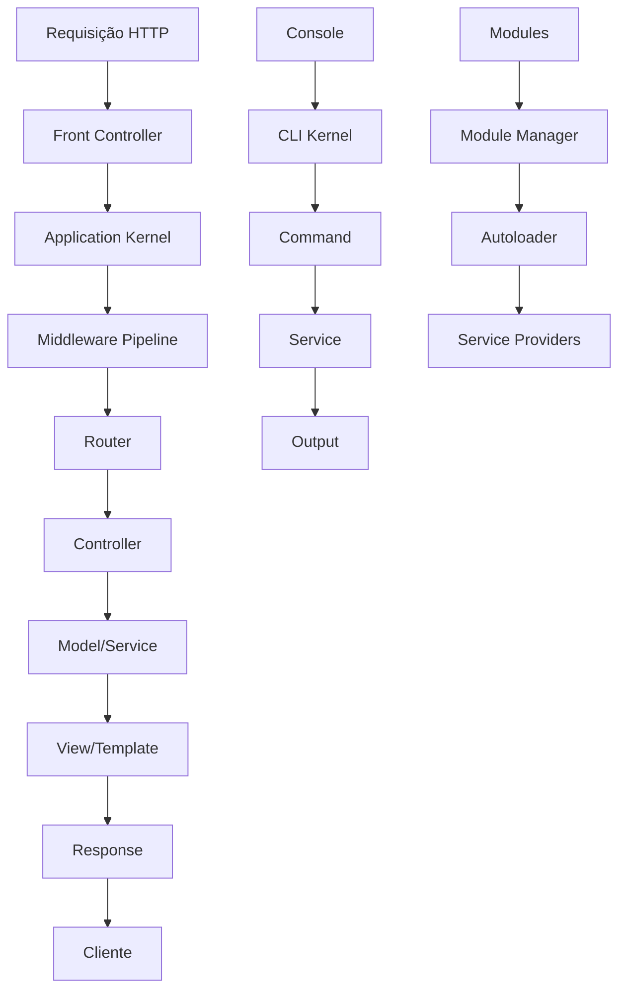

# Plano Completo do Framework PHP Leve "Coyote"

## Visão Geral
Framework PHP completo mas extremamente leve, focado em performance, modularidade e simplicidade.

## Arquitetura do Sistema



## Módulos Principais

### 1. Core (Núcleo)
- **Application**: Container da aplicação
- **Container**: Injeção de dependências (DI)
- **Config**: Gerenciamento de configurações
- **Bootstrap**: Inicialização do sistema
- **Service Providers**: Provedores de serviços

### 2. HTTP Layer
- **Request/Response**: Manipulação HTTP
- **Router**: Sistema de roteamento
- **Controllers**: Controladores base
- **Middleware**: Pipeline de middlewares
- **Session/Cookie**: Gerenciamento de estado

### 3. Database Layer
- **Connection Manager**: Múltiplas conexões PDO
- **Query Builder**: Construtor de queries
- **Model**: ORM básico
- **Migrations**: Sistema de migrações
- **DBAL**: Abstração de banco de dados

### 4. Authentication & Authorization
- **Auth Manager**: Gerenciador de autenticação
- **Guards**: Drivers (session, token, JWT)
- **User Model**: Modelo de usuário
- **Policies**: Autorização baseada em políticas
- **Gates**: Portões de autorização

### 5. Validation & Forms
- **Validator**: Validação de dados
- **Rules**: Regras de validação
- **Form Builder**: Construtor de formulários
- **Form Types**: Tipos de campos
- **Sanitization**: Sanitização de inputs

### 6. View & Templates
- **Template Engine**: Motor de templates
- **View Composers**: Composição de views
- **Components**: Componentes reutilizáveis
- **Layouts**: Sistema de layouts
- **Asset Management**: Gerenciamento de assets

### 7. Cache System
- **Cache Manager**: Gerenciador de cache
- **Drivers**: File, Redis, Memcached, Array
- **Tags**: Cache com tags
- **Locking**: Sistema de locks

### 8. CLI & Console
- **Command Kernel**: Núcleo CLI
- **Command Base**: Base para comandos
- **Scheduler**: Agendador de tarefas
- **Interactive Console**: Console interativo

### 9. Modules System
- **Module Manager**: Gerenciador de módulos
- **Module Loader**: Carregador de módulos
- **Module Discovery**: Descoberta de módulos
- **Dependency Resolution**: Resolução de dependências

### 10. Support & Utilities
- **Helpers**: Funções auxiliares
- **Str/Arr**: Manipulação de strings/arrays
- **Filesystem**: Operações de arquivos
- **Logging**: Sistema de logs
- **Error Handling**: Tratamento de erros

## Estrutura de Diretórios

```
coyote/
├── public/                 # Document root
│   └── index.php          # Front controller
├── vendors/               # Framework core
│   ├── coyote/            # Namespace principal
│   │   ├── Core/          # Núcleo
│   │   ├── Http/          # Camada HTTP
│   │   ├── Database/      # Banco de dados
│   │   ├── Auth/          # Autenticação
│   │   ├── Validation/    # Validação
│   │   ├── View/          # Views
│   │   ├── Cache/         # Cache
│   │   ├── Cli/           # CLI
│   │   ├── Modules/       # Módulos
│   │   └── Support/       # Utilitários
│   └── autoload.php       # Autoloader
├── app/                   # Aplicação
│   ├── Controllers/
│   ├── Models/
│   ├── Views/
│   ├── Middleware/
│   ├── Providers/
│   └── Console/
├── config/                # Configurações
│   ├── app.php
│   ├── database.php
│   ├── cache.php
│   ├── auth.php
│   └── modules.php
├── routes/                # Rotas
│   ├── web.php
│   ├── api.php
│   └── console.php
├── storage/               # Armazenamento
│   ├── cache/
│   ├── logs/
│   ├── sessions/
│   ├── views/
│   └── framework/
├── modules/               # Módulos
│   ├── Blog/
│   ├── Shop/
│   └── Admin/
├── tests/                 # Testes
└── composer.json          # Dependências
```

## Fluxo de Desenvolvimento

### 1. Instalação
```bash
composer create-project coyote/framework myapp
cd myapp
php coyote serve
```

### 2. Criação de Controller
```bash
php coyote make:controller UserController
```

### 3. Definição de Rotas
```php
// routes/web.php
$router->get('/users', 'UserController@index');
$router->get('/users/{id}', 'UserController@show');
$router->post('/users', 'UserController@store');
```

### 4. Criação de Model
```bash
php coyote make:model User --migration
```

### 5. Criação de Migration
```bash
php coyote make:migration create_users_table
```

### 6. Execução de Migrations
```bash
php coyote migrate
```

### 7. Criação de Módulo
```bash
php coyote make:module Blog
```

## Sistema de Módulos

### Características
- **Autoload automático**: PSR-4 para cada módulo
- **Dependências**: Resolução automática
- **Service Providers**: Registro automático
- **Routes**: Carregamento automático
- **Migrations**: Isoladas por módulo
- **Views**: Namespaced por módulo
- **Config**: Configuração por módulo

### Estrutura de Módulo
```
modules/Blog/
├── src/
│   ├── Controllers/
│   ├── Models/
│   ├── Views/
│   ├── Providers/
│   └── BlogModule.php
├── routes/
│   └── web.php
├── config/
│   └── blog.php
├── migrations/
├── resources/
│   └── views/
├── tests/
└── composer.json
```

## Performance Features

### 1. Cache de Configuração
- Configurações compiladas em um único arquivo
- Cache de rotas
- Cache de views compiladas
- Cache de autoloader

### 2. Otimizações
- Lazy loading de serviços
- Compilação de containers
- Minificação de assets
- Cache HTTP

### 3. Monitoring
- Profiling de requisições
- Logging estruturado
- Métricas de performance
- Health checks

## Segurança

### 1. Proteções
- CSRF protection
- XSS protection
- SQL injection prevention
- Rate limiting
- CORS management

### 2. Autenticação
- Multiple guards
- JWT tokens
- OAuth2 integration
- Two-factor authentication

### 3. Autorização
- Role-based access control (RBAC)
- Permission-based access
- Policy-based authorization
- Resource gates

## APIs RESTful

### 1. Resource Controllers
```php
class UserController extends ApiController
{
    public function index()
    {
        return User::paginate();
    }
    
    public function store(UserRequest $request)
    {
        $user = User::create($request->validated());
        return response()->json($user, 201);
    }
}
```

### 2. API Features
- JSON responses
- Pagination
- Filtering
- Sorting
- Resource transformers
- API versioning
- Rate limiting
- API documentation (OpenAPI)

## Data Grid System

### 1. Features
- Paginação automática
- Ordenação por colunas
- Filtros avançados
- Exportação (CSV, Excel, PDF)
- Ações em massa
- Responsive design

### 2. Usage
```php
$grid = new DataGrid(User::query());
$grid->addColumn('id', 'ID')->sortable();
$grid->addColumn('name', 'Name')->searchable();
$grid->addColumn('email', 'Email')->filterable();
$grid->addAction('edit', 'Edit', fn($user) => route('users.edit', $user));
return $grid->render();
```

## Form Builder System

### 1. Features
- Tipos de campos
- Validação integrada
- CSRF protection
- File uploads
- Conditional fields
- Form themes

### 2. Usage
```php
$form = new FormBuilder();
$form->add('name', 'text', ['label' => 'Name', 'required' => true]);
$form->add('email', 'email', ['label' => 'Email']);
$form->add('password', 'password', ['label' => 'Password']);
$form->add('submit', 'submit', ['label' => 'Save']);
return $form->render();
```

## Próximos Passos de Implementação

### Fase 1: Núcleo (Week 1-2)
1. Implementar Application e Container DI
2. Implementar autoloader PSR-4
3. Implementar sistema de configuração
4. Implementar service providers

### Fase 2: HTTP Layer (Week 3-4)
1. Implementar Request/Response
2. Implementar sistema de roteamento
3. Implementar controllers base
4. Implementar middleware pipeline

### Fase 3: Database (Week 5-6)
1. Implementar connection manager
2. Implementar query builder
3. Implementar Model ORM básico
4. Implementar sistema de migrations

### Fase 4: Auth & Validation (Week 7-8)
1. Implementar sistema de autenticação
2. Implementar validação
3. Implementar form builder
4. Implementar session/cookie management

### Fase 5: Views & Cache (Week 9-10)
1. Implementar template engine
2. Implementar view components
3. Implementar sistema de cache
4. Implementar asset management

### Fase 6: CLI & Modules (Week 11-12)
1. Implementar CLI kernel
2. Implementar comandos base
3. Implementar sistema de módulos
4. Implementar module manager

### Fase 7: APIs & Advanced (Week 13-14)
1. Implementar API resources
2. Implementar data grid
3. Implementar monitoring
4. Implementar security features

### Fase 8: Testing & Docs (Week 15-16)
1. Escrever testes unitários
2. Escrever documentação
3. Criar exemplos
4. Otimizar performance

## Requisitos Técnicos

### PHP
- PHP 8.1 ou superior
- Extensões: PDO, JSON, MBString, OpenSSL
- Composer 2.0+

### Database
- MySQL 5.7+ / MariaDB 10.2+
- PostgreSQL 10+
- SQLite 3.8+

### Web Server
- Apache 2.4+ com mod_rewrite
- Nginx 1.14+
- PHP-FPM recomendado

## Comparação com Outros Frameworks

| Feature | Coyote | Laravel | Symfony | Lumen |
|---------|---------|---------|---------|-------|
| Tamanho | ~2MB | ~40MB | ~60MB | ~5MB |
| Performance | ⭐⭐⭐⭐⭐ | ⭐⭐⭐ | ⭐⭐ | ⭐⭐⭐⭐ |
| Simplicidade | ⭐⭐⭐⭐⭐ | ⭐⭐⭐ | ⭐⭐ | ⭐⭐⭐⭐ |
| Features | ⭐⭐⭐⭐ | ⭐⭐⭐⭐⭐ | ⭐⭐⭐⭐⭐ | ⭐⭐⭐ |
| Modularidade | ⭐⭐⭐⭐⭐ | ⭐⭐⭐ | ⭐⭐⭐⭐ | ⭐⭐ |
| Learning Curve | Baixa | Média | Alta | Média |

## Conclusão

O framework Coyote será uma solução PHP moderna, leve e poderosa que combina a simplicidade dos micro-frameworks com a funcionalidade completa dos frameworks enterprise. Focado em performance, modularidade e developer experience, será ideal para projetos de todos os tamanhos.

**Próxima ação**: Solicitar aprovação deste plano e iniciar implementação na fase 1.