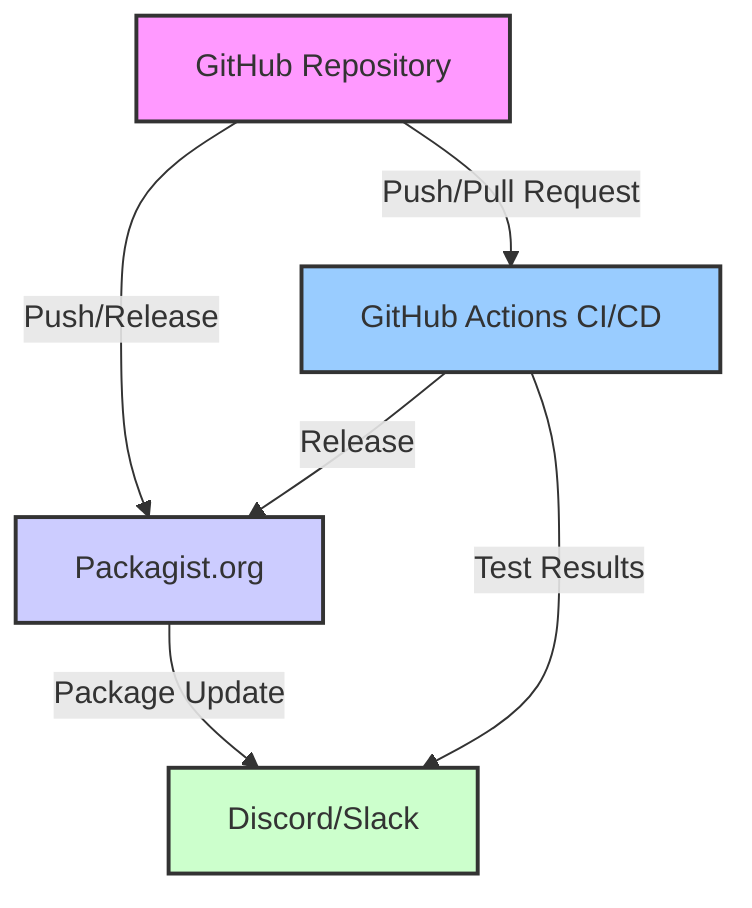

# Plano para Configuração de Webhooks

## 📋 **Visão Geral**

Configurar webhooks para integração automática entre GitHub, Packagist e outros serviços, garantindo atualizações automáticas e notificações.

## 🎯 **Objetivos**

1. **Configurar webhook GitHub → Packagist** para atualizações automáticas
2. **Configurar webhook Packagist → Discord/Slack** para notificações
3. **Configurar webhook GitHub Actions → Packagist** para CI/CD
4. **Monitorar webhooks** para garantir funcionamento contínuo
5. **Documentar configuração** para manutenção

## 🔗 **Arquitetura de Webhooks**



## 🔧 **Webhook 1: GitHub → Packagist**

### **Configuração no Packagist**
1. Acessar https://packagist.org
2. Navegar para pacote `coyote/framework`
3. Ir para "Settings" > "GitHub Integration"
4. Habilitar "Auto-Update"
5. Configurar eventos:
   - ✅ Push
   - ✅ Release
   - ✅ Tag
6. Salvar configuração

### **Configuração no GitHub**
1. Acessar https://github.com/coyoteframework/framework/settings/hooks
2. Verificar webhook criado pelo Packagist:
   - URL: `https://packagist.org/api/github`
   - Content type: `application/json`
   - Events: `Push`, `Release`
3. Testar webhook:
   - Enviar teste do GitHub
   - Verificar logs no Packagist

### **Teste de Funcionamento**
```bash
# 1. Criar tag de teste
git tag -a v1.0.2-test -m "Test webhook"
git push --tags

# 2. Verificar no Packagist
# Acessar https://packagist.org/packages/coyote/framework
# Verificar se versão aparece (pode levar 1-2 minutos)

# 3. Limpar tag de teste
git tag -d v1.0.2-test
git push origin :refs/tags/v1.0.2-test
```

## 🔔 **Webhook 2: Packagist → Discord**

### **Criar Webhook no Discord**
1. No Discord, acessar configurações do canal
2. Integrations > Webhooks > New Webhook
3. Configurar:
   - Name: `Packagist Updates`
   - Channel: `#releases` ou `#notifications`
   - Copiar URL do webhook
4. Salvar

### **Configurar no Packagist**
1. No Packagist, pacote `coyote/framework`
2. Settings > Notifications
3. Adicionar webhook Discord:
   - URL: `https://discord.com/api/webhooks/...`
   - Events: `Package updated`, `Security advisory`
4. Testar notificação

### **Mensagem de Exemplo**
```json
{
  "content": "📦 **Coyote Framework atualizado!**",
  "embeds": [{
    "title": "v1.1.0 released",
    "description": "Nova versão disponível no Packagist",
    "url": "https://packagist.org/packages/coyote/framework",
    "color": 5814783,
    "fields": [
      {"name": "Versão", "value": "v1.1.0", "inline": true},
      {"name": "Downloads", "value": "1,234", "inline": true},
      {"name": "GitHub", "value": "[Ver Release](https://github.com/coyoteframework/framework/releases/tag/v1.1.0)"}
    ],
    "timestamp": "2026-03-30T21:00:00.000Z"
  }]
}
```

## ⚙️ **Webhook 3: GitHub Actions → Packagist API**

### **Workflow para Atualização Manual**
```yaml
# .github/workflows/update-packagist.yml
name: Update Packagist

on:
  workflow_dispatch:  # Manual trigger
  release:
    types: [published]

jobs:
  update:
    runs-on: ubuntu-latest
    steps:
      - name: Update Packagist via API
        run: |
          curl -X POST https://packagist.org/api/update-package \
            -H "Content-Type: application/json" \
            -d '{
              "repository": {
                "url": "https://github.com/coyoteframework/framework"
              }
            }' \
            -u "${{ secrets.PACKAGIST_USERNAME }}:${{ secrets.PACKAGIST_TOKEN }}"
```

### **Configurar Secrets no GitHub**
1. Acessar https://github.com/coyoteframework/framework/settings/secrets/actions
2. Adicionar secrets:
   - `PACKAGIST_USERNAME` - Usuário do Packagist
   - `PACKAGIST_TOKEN` - Token API do Packagist
3. Testar workflow manualmente

## 📊 **Webhook 4: Monitoramento e Logs**

### **Estrutura de Logs**
```
logs/webhooks/
├── github-push.log
├── packagist-update.log
├── discord-notifications.log
└── errors.log
```

### **Script de Monitoramento**
```php
// scripts/monitor-webhooks.php
<?php
$webhooks = [
    'github_packagist' => 'https://api.github.com/repos/coyoteframework/framework/hooks',
    'packagist_discord' => 'https://packagist.org/api/...',
];

foreach ($webhooks as $name => $url) {
    $status = checkWebhook($url);
    logStatus($name, $status);
}

function checkWebhook($url) {
    // Implementar verificação
    return ['active' => true, 'last_delivery' => date('Y-m-d H:i:s')];
}
```

## 🛡️ **Segurança dos Webhooks**

### **Melhores Práticas**
1. **Use HTTPS** para todos os webhooks
2. **Secrets em variáveis de ambiente**, nunca no código
3. **Validate payloads** com assinaturas
4. **Rate limiting** para prevenir abuso
5. **Log todas as entregas** para auditoria

### **Validação de Payload GitHub**
```php
// Validar assinatura do webhook GitHub
$signature = $_SERVER['HTTP_X_HUB_SIGNATURE_256'];
$payload = file_get_contents('php://input');
$expected = 'sha256=' . hash_hmac('sha256', $payload, $secret);

if (hash_equals($expected, $signature)) {
    // Payload válido
}
```

## 🧪 **Testes de Webhooks**

### **Teste 1: GitHub → Packagist**
```bash
# Simular push
curl -X POST https://api.github.com/repos/coyoteframework/framework/dispatches \
  -H "Authorization: token $GITHUB_TOKEN" \
  -d '{"event_type": "test_webhook"}'
```

### **Teste 2: Packagist → Discord**
```bash
# Testar webhook Discord
curl -X POST https://discord.com/api/webhooks/... \
  -H "Content-Type: application/json" \
  -d '{"content": "Test notification"}'
```

### **Teste 3: GitHub Actions → Packagist**
```bash
# Executar workflow manualmente
gh workflow run update-packagist.yml
```

## 🗓️ **Cronograma de Implementação**

| Etapa | Duração | Status |
|-------|---------|--------|
| Configurar GitHub → Packagist | 30 min | |
| Configurar Packagist → Discord | 30 min | |
| Configurar GitHub Actions API | 45 min | |
| Implementar monitoramento | 1 hora | |
| Testar todos os webhooks | 1 hora | |
| Documentar configuração | 45 min | |
| **Total** | **4h 30min** | |

## ⚠️ **Riscos e Mitigações**

### **Risco 1: Webhook Inativo**
- **Sintoma**: Atualizações não refletem no Packagist
- **Mitigação**: Monitoramento ativo, notificações de falha
- **Fallback**: Atualização manual via API

### **Risco 2: Rate Limiting**
- **Sintoma**: Webhooks bloqueados temporariamente
- **Mitigação**: Implementar retry com backoff exponencial
- **Configuração**: Respeitar limites de API

### **Risco 3: Segurança**
- **Sintoma**: Payloads maliciosos ou falsificados
- **Mitigação**: Validação de assinatura, IP whitelisting
- **Auditoria**: Logs detalhados de todas as entregas

### **Risco 4: Configuração Complexa**
- **Sintoma**: Dificuldade de manutenção
- **Mitigação**: Documentação clara, scripts de configuração
- **Backup**: Configurações exportadas regularmente

## 📈 **Métricas de Sucesso**

1. ✅ Webhook GitHub → Packagist funcionando (atualizações em < 2 min)
2. ✅ Notificações Discord recebidas para cada release
3. ✅ GitHub Actions atualizando Packagist via API
4. ✅ Logs de webhooks sendo gerados e monitorados
5. ✅ 0 falhas de entrega nos últimos 7 dias
6. ✅ Tempo de resposta médio < 500ms

## 🔄 **Manutenção Contínua**

### **Rotinas Diárias**
- Verificar logs de webhooks
- Monitorar falhas de entrega
- Verificar rate limits

### **Rotinas Semanais**
- Testar todos os webhooks
- Revisar configurações de segurança
- Atualizar documentação se necessário

### **Rotinas Mensais**
- Revisar tokens e secrets
- Analisar métricas de performance
- Otimizar configurações

## 📚 **Documentação para Manutenção**

### **Arquivo de Configuração**
```yaml
# config/webhooks.yaml
webhooks:
  github_packagist:
    enabled: true
    url: https://packagist.org/api/github
    events: [push, release]
    secret: ${GITHUB_WEBHOOK_SECRET}
    
  packagist_discord:
    enabled: true
    url: ${DISCORD_WEBHOOK_URL}
    events: [package_updated, security_advisory]
    
monitoring:
  enabled: true
  check_interval: 300  # 5 minutos
  alert_channel: discord
```

### **Comandos Úteis**
```bash
# Testar webhook específico
php scripts/test-webhook.php github_packagist

# Verificar status
php scripts/monitor-webhooks.php

# Reconfigurar webhook
php scripts/setup-webhooks.php --reset
```

### **Links de Administração**
- GitHub Webhooks: `https://github.com/coyoteframework/framework/settings/hooks`
- Packagist Settings: `https://packagist.org/packages/coyote/framework/settings`
- Discord Webhooks: Configurações do canal > Integrations
- GitHub Actions Secrets: `https://github.com/coyoteframework/framework/settings/secrets/actions`

---

**Status**: Pronto para implementação  
**Prioridade**: Alta (necessário para fluxo automatizado)  
**Complexidade**: Média  
**Dependências**: Packagist publicado, contas configuradas