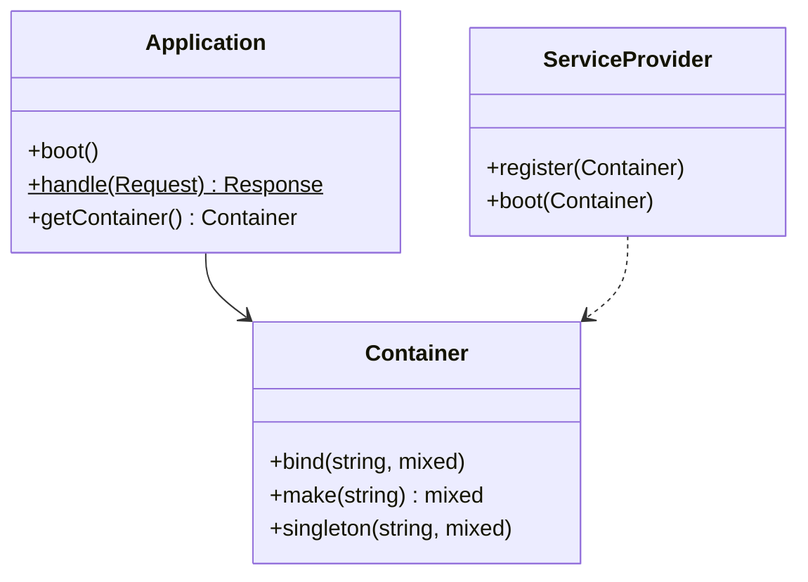
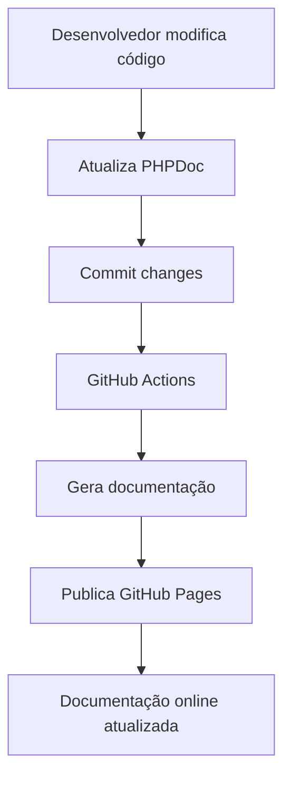

# Plano para Documentação da API Completa

## 📋 **Visão Geral**

Criar documentação completa e profissional da API pública do Coyote Framework para facilitar adoção por desenvolvedores.

## 🎯 **Objetivos**

1. **Documentar todas as classes públicas** do framework
2. **Criar referência de API** navegável e pesquisável
3. **Fornecer exemplos práticos** para cada funcionalidade
4. **Estruturar documentação** por módulos e casos de uso
5. **Integrar com ferramentas** de geração automática

## 📊 **Situação Atual**

### **Documentação Existente**
- `README.md` - Visão geral e instalação ✅
- `docs/` - Documentação em formato wiki ✅
- Comentários PHPDoc em algumas classes ⚠️
- Falta documentação de API sistemática ❌

### **Cobertura por Módulo**
- **Core**: Documentação básica
- **Http**: Alguns exemplos
- **Database**: Documentação moderada
- **Auth**: Documentação mínima
- **Validation**: Documentação boa
- **Forms**: Documentação moderada
- **Outros**: Pouca ou nenhuma documentação

## 🏗️ **Arquitetura da Documentação**

### **Estrutura Proposta**
```
docs/
├── api/                    # Documentação de API
│   ├── Core/              # API do núcleo
│   ├── Http/              # API HTTP
│   ├── Database/          # API de banco
│   ├── Auth/              # API de autenticação
│   ├── Validation/        # API de validação
│   ├── Forms/             # API de formulários
│   ├── View/              # API de views
│   └── index.md           # Índice da API
├── examples/              # Exemplos práticos
├── guides/               # Guias passo a passo
├── reference/            # Referência rápida
└── README.md             # Documentação principal
```

### **Formato de Documentação**
- **Markdown** para facilidade de edição
- **PHPDoc** para geração automática
- **Exemplos em código** para cada método
- **Diagramas** para relações complexas

## 🔧 **Ferramentas de Documentação**

### **1. PHPDoc Generator**
```bash
# Instalar dependências
composer require --dev phpdocumentor/phpdocumentor

# Gerar documentação
vendor/bin/phpdoc -d src -t docs/api-generated
```

### **2. Integração com GitHub Pages**
```yaml
# .github/workflows/docs.yml
name: Deploy Documentation

on:
  push:
    branches: [main]
    paths: ['src/**', 'docs/**']

jobs:
  deploy:
    runs-on: ubuntu-latest
    steps:
      - uses: actions/checkout@v3
      - name: Generate API Docs
        run: |
          composer require --dev phpdocumentor/phpdocumentor
          vendor/bin/phpdoc -d src -t docs/api
      - name: Deploy to GitHub Pages
        uses: peaceiris/actions-gh-pages@v3
        with:
          github_token: ${{ secrets.GITHUB_TOKEN }}
          publish_dir: ./docs
```

### **3. Ferramentas Auxiliares**
- **PHPStan** para análise de tipos
- **Psalm** para verificação estática
- **Doctum** para documentação moderna

## 📚 **Conteúdo por Módulo**

### **Módulo Core**
```markdown
# Core API Reference

## Application
### Métodos Públicos
- `__construct(string $basePath)` - Cria nova instância da aplicação
- `boot()` - Inicializa a aplicação e service providers
- `getContainer()` - Retorna o container de DI
- `handle(Request $request)` - Processa uma requisição HTTP

### Exemplo
```php
use Coyote\Core\Application;

$app = new Application(__DIR__);
$app->boot();

// Registrar rotas, serviços, etc.
```

## Container
### Métodos Públicos
- `bind(string $abstract, $concrete)` - Registra binding
- `singleton(string $abstract, $concrete)` - Registra singleton
- `make(string $abstract)` - Resolve instância
- `instance(string $abstract, $instance)` - Registra instância existente
```

### **Módulo Http**
```markdown
# Http API Reference

## Request
### Métodos Públicos
- `method()` - Retorna método HTTP (GET, POST, etc.)
- `path()` - Retorna caminho da URL
- `query(string $key, $default = null)` - Retorna parâmetro de query
- `input(string $key, $default = null)` - Retorna input do formulário
- `header(string $key, $default = null)` - Retorna header

## Response
### Métodos Públicos
- `__construct($content, int $status = 200, array $headers = [])`
- `setContent($content)` - Define conteúdo da resposta
- `setStatusCode(int $code)` - Define código de status
- `header(string $name, string $value)` - Adiciona header
```

## 📈 **Plano de Implementação por Fase**

### **Fase 1: Infraestrutura (Semana 1)**
1. Configurar PHPDoc nos arquivos fonte
2. Configurar pipeline de geração automática
3. Criar estrutura de diretórios da documentação
4. Configurar GitHub Pages para hospedagem

### **Fase 2: Documentação Core (Semana 2)**
1. Documentar `Application` e ciclo de vida
2. Documentar `Container` e injeção de dependências
3. Documentar `Config` e gerenciamento de configuração
4. Documentar `ServiceProvider` e extensibilidade

### **Fase 3: Documentação Http (Semana 3)**
1. Documentar `Request` e `Response`
2. Documentar `Router` e sistema de rotas
3. Documentar `Controller` base
4. Documentar `Middleware` pipeline

### **Fase 4: Documentação Database (Semana 4)**
1. Documentar `Connection` e configuração
2. Documentar `QueryBuilder` e operações
3. Documentar `Model` e ORM
4. Documentar `Migration` e versionamento

### **Fase 5: Documentação Auth e Validation (Semana 5)**
1. Documentar `AuthManager` e autenticação
2. Documentar `Validator` e regras
3. Documentar `FormRequest` e validação

### **Fase 6: Documentação Forms e View (Semana 6)**
1. Documentar `FormBuilder` e API fluente
2. Documentar `ViewFactory` e templates
3. Documentar helpers e utilitários

## 🧪 **Padrões de Documentação**

### **PHPDoc Completo**
```php
/**
 * Classe principal da aplicação Coyote Framework
 *
 * Responsável por inicializar o framework, gerenciar service providers
 * e processar requisições HTTP.
 *
 * @package Coyote\Core
 * @since 1.0.0
 */
class Application
{
    /**
     * Cria uma nova instância da aplicação
     *
     * @param string $basePath Caminho base da aplicação
     * @throws \InvalidArgumentException Se o caminho não existir
     * @example
     * ```php
     * $app = new Application(__DIR__);
     * $app->boot();
     * ```
     */
    public function __construct(string $basePath)
    {
        // ...
    }
    
    /**
     * Processa uma requisição HTTP
     *
     * @param Request $request Requisição a ser processada
     * @return Response Resposta HTTP
     * @throws \RuntimeException Se a aplicação não estiver bootada
     */
    public function handle(Request $request): Response
    {
        // ...
    }
}
```

### **Exemplos Práticos**
```markdown
## Exemplo: Criando uma Rota Básica

```php
use Coyote\Core\Application;

$app = new Application(__DIR__);

// Rota GET simples
$app->router->get('/', function() {
    return 'Bem-vindo ao Coyote Framework!';
});

// Rota com parâmetros
$app->router->get('/user/{id}', function($id) {
    return "Usuário ID: {$id}";
});

// Rota para controller
$app->router->get('/posts', 'PostController@index');
```

### **Diagramas de Relacionamento**


## 📊 **Métricas de Qualidade**

### **Cobertura de Documentação**
- **Classes públicas**: 100% documentadas
- **Métodos públicos**: 95%+ documentados
- **Exemplos**: Pelo menos 1 exemplo por classe
- **PHPDoc completo**: Tipos de retorno, parâmetros, exceções

### **Qualidade da Documentação**
- **Clareza**: Fácil de entender para novos desenvolvedores
- **Consistência**: Padrão uniforme em toda a documentação
- **Atualização**: Mantida em sincronia com o código
- **Pesquisabilidade**: Fácil de encontrar informações

## 🔄 **Processo de Manutenção**

### **Fluxo de Trabalho**


### **Checklist para Pull Requests**
```markdown
- [ ] PHPDoc atualizado para classes modificadas
- [ ] Exemplos atualizados se API mudou
- [ ] Documentação de breaking changes
- [ ] CHANGELOG.md atualizado
```

## ⚠️ **Riscos e Mitigações**

### **Risco 1: Documentação Desatualizada**
- **Problema**: Documentação não reflete o código atual
- **Mitigação**: Integrar geração automática no CI/CD
- **Solução**: Bloquear merge se documentação estiver desatualizada

### **Risco 2: Complexidade Excessiva**
- **Problema**: Documentação muito técnica ou complexa
- **Mitigação**: Focar em exemplos práticos
- **Solução**: Revisão por desenvolvedores novatos

### **Risco 3: Manutenção Cansativa**
- **Problema**: Custo alto para manter documentação atualizada
- **Mitigação**: Automatizar o máximo possível
- **Solução**: Ferramentas de geração automática

### **Risco 4: Falta de Adoção**
- **Problema**: Desenvolvedores não usam a documentação
- **Mitigação**: Tornar a documentação fácil de encontrar e usar
- **Solução**: Integrar com IDE via PHPDoc

## 📅 **Cronograma Detalhado**

| Semana | Módulo | Tarefas | Horas Estimadas |
|--------|--------|---------|-----------------|
| 1 | Infraestrutura | PHPDoc, GitHub Pages, CI/CD | 10 |
| 2 | Core | Application, Container, Config, ServiceProvider | 12 |
| 3 | Http | Request, Response, Router, Middleware | 10 |
| 4 | Database | Connection, QueryBuilder, Model, Migration | 12 |
| 5 | Auth | AuthManager, Guards, UserProvider | 8 |
| 6 | Validation | Validator, Rules, FormRequest | 8 |
| 7 | Forms e View | FormBuilder, ViewFactory, Helpers | 10 |
| 8 | Revisão | Revisão completa, exemplos adicionais | 10 |
| **Total** | | | **80 horas** |

## 🌐 **Hospedagem e Acesso**

### **GitHub Pages**
- URL: `https://coyoteframework.github.io/framework`
- Branch: `gh-pages`
- Atualização automática via GitHub Actions

### **Read the Docs (Alternativa)**
```yaml
# .readthedocs.yml
version: 2

build:
  os: ubuntu-20.04
  tools:
    python: "3.9"

sphinx:
  configuration: docs/conf.py

formats:
  - pdf
  - epub

python:
  install:
    - requirements: docs/requirements.txt
```

### **Integração com Packagist**
```markdown
# No README.md
[](https://coyoteframework.github.io/framework)
```

## 📖 **Exemplos de Páginas**

### **Página de Índice**
```markdown
# Coyote Framework API Documentation

## Módulos
- [Core](api/Core/) - Núcleo do framework
- [Http](api/Http/) - Camada HTTP
- [Database](api/Database/) - Banco de dados
- [Auth](api/Auth/) - Autenticação
- [Validation](api/Validation/) - Validação
- [Forms](api/Forms/) - Formulários
- [View](api/View/) - Sistema de templates

## Guias Rápidos
- [Primeiros Passos](guides/getting-started.md)
- [Criando uma API REST](guides/rest-api.md)
- [Autenticação de Usuários](guides/authentication.md)

## Referência
- [Índice de Classes](reference/class-index.md)
- [Índice de Métodos](reference/method-index.md)
- [CHANGELOG](../CHANGELOG.md)
```

### **Página de Classe**
```markdown
# Application

Classe principal do Coyote Framework.

**Namespace**: `Coyote\Core`  
**Since**: 1.0.0

## Descrição
A classe `Application` é o ponto de entrada principal do framework. Ela gerencia o ciclo de vida da aplicação, service providers e processamento de requisições.

## Métodos Públicos

### __construct()
```php
public function __construct(string $basePath)
```

Cria uma nova instância da aplicação.

**Parâmetros:**
- `$basePath` (string) - Caminho base da aplicação

**Exceções:**
- `InvalidArgumentException` - Se o caminho não existir

**Exemplo:**
```php
$app = new Application(__DIR__);
```

### boot()
```php
public function boot(): void
```

Inicializa a aplicação, carregando configurações e bootando service providers.

**Exemplo:**
```php
$app = new Application(__DIR__);
$app->boot();
```

## Exemplos Completos

### Aplicação Básica
```php
use Coyote\Core\Application;

$app = new Application(__DIR__);
$app->boot();

$app->router->get('/', function() {
    return 'Hello World';
});

$response = $app->handle($request);
echo $response->getContent();
```

## Veja Também
- [Container](Container.md) - Injeção de dependências
- [ServiceProvider](ServiceProvider.md) - Provedores de serviço
- [Config](Config.md) - Gerenciamento de configuração
```

---

**Status**: Pronto para implementação  
**Prioridade**: Alta (facilita adoção do framework)  
**Complexidade**: Alta (abrange toda a API pública)  
**Impacto**: Crítico (experiência do desenvolvedor)