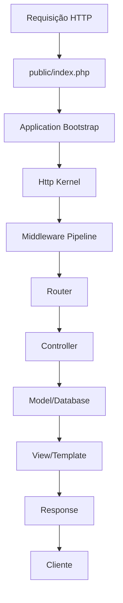

# Estrutura do Framework PHP Leve

## Visão Geral
Framework PHP completo mas extremamente leve, com foco em modularidade e performance.

## Estrutura de Diretórios

```
coyote/                    # Raiz do projeto (programa de teste)
├── public/               # Document root
│   └── index.php        # Ponto de entrada
├── vendors/             # Framework principal
│   ├── coyote/          # Namespace principal do framework
│   │   ├── Core/        # Núcleo do framework
│   │   │   ├── Application.php
│   │   │   ├── Container.php
│   │   │   ├── Config.php
│   │   │   └── Bootstrap.php
│   │   ├── Routing/     # Sistema de roteamento
│   │   │   ├── Router.php
│   │   │   ├── Route.php
│   │   │   └── RouteCollection.php
│   │   ├── Http/        # Camada HTTP
│   │   │   ├── Request.php
│   │   │   ├── Response.php
│   │   │   ├── Kernel.php
│   │   │   └── Middleware/
│   │   ├── Database/    # Camada de banco de dados
│   │   │   ├── Connection.php
│   │   │   ├── QueryBuilder.php
│   │   │   ├── Model.php
│   │   │   └── Migrations/
│   │   ├── Auth/        # Autenticação
│   │   │   ├── Auth.php
│   │   │   ├── Guards/
│   │   │   └── User.php
│   │   ├── Validation/  # Validação
│   │   │   ├── Validator.php
│   │   │   ├── Rules/
│   │   │   └── FormRequest.php
│   │   ├── View/        # Sistema de views
│   │   │   ├── View.php
│   │   │   ├── TemplateEngine.php
│   │   │   └── Components/
│   │   ├── Cache/       # Sistema de cache
│   │   │   ├── Cache.php
│   │   │   ├── Drivers/
│   │   │   └── CacheManager.php
│   │   ├── CLI/         # Interface de linha de comando
│   │   │   ├── Command.php
│   │   │   ├── Kernel.php
│   │   │   └── Commands/
│   │   ├── Modules/     # Sistema de módulos
│   │   │   ├── Module.php
│   │   │   ├── ModuleManager.php
│   │   │   └── Loader.php
│   │   └── Support/     # Utilitários
│   │       ├── Helpers.php
│   │       ├── Str.php
│   │       ├── Arr.php
│   │       └── Filesystem.php
│   └── autoload.php     # Autoloader principal
├── app/                 # Aplicação do usuário
│   ├── Controllers/
│   ├── Models/
│   ├── Views/
│   ├── Middleware/
│   └── Providers/
├── config/              # Configurações
│   ├── app.php
│   ├── database.php
│   ├── cache.php
│   └── auth.php
├── storage/             # Armazenamento
│   ├── cache/
│   ├── logs/
│   ├── sessions/
│   └── views/
├── tests/               # Testes
└── composer.json        # Dependências
```

## Módulos Principais

### 1. Core (Núcleo)
- **Application**: Container principal da aplicação
- **Container**: Injeção de dependências
- **Config**: Gerenciamento de configurações
- **Bootstrap**: Inicialização do framework

### 2. Routing (Roteamento)
- **Router**: Mapeamento URL → Controller
- **Route**: Definição de rotas
- **RouteCollection**: Coleção de rotas

### 3. Http (HTTP)
- **Request**: Manipulação de requisições HTTP
- **Response**: Criação de respostas HTTP
- **Kernel**: Núcleo HTTP
- **Middleware**: Pipeline de middlewares

### 4. Database (Banco de Dados)
- **Connection**: Conexões PDO múltiplas
- **QueryBuilder**: Construtor de queries
- **Model**: ORM básico
- **Migrations**: Sistema de migrações

### 5. Auth (Autenticação)
- **Auth**: Gerenciamento de autenticação
- **Guards**: Drivers de autenticação
- **User**: Modelo de usuário

### 6. Validation (Validação)
- **Validator**: Validação de dados
- **Rules**: Regras de validação
- **FormRequest**: Request com validação

### 7. View (Visualização)
- **View**: Renderização de templates
- **TemplateEngine**: Motor de templates
- **Components**: Componentes reutilizáveis

### 8. Cache (Cache)
- **Cache**: Sistema de cache
- **Drivers**: Drivers (file, redis, memcached)
- **CacheManager**: Gerenciador de cache

### 9. CLI (Linha de Comando)
- **Command**: Base para comandos
- **Kernel**: Núcleo CLI
- **Commands**: Comandos built-in

### 10. Modules (Módulos)
- **Module**: Definição de módulo
- **ModuleManager**: Gerenciador de módulos
- **Loader**: Carregador de módulos

## Fluxo de Requisição



## Sistema de Autoload
- PSR-4 compliant
- Namespace principal: `Coyote\`
- Mapeamento automático de diretórios
- Otimizado para performance

## Próximos Passos
1. Criar estrutura de diretórios física
2. Implementar autoloader PSR-4
3. Desenvolver núcleo (Application/Container)
4. Implementar sistema de roteamento
5. Desenvolver camada HTTP
6. Implementar sistema de database
7. Desenvolver módulos restantes
8. Criar documentação
9. Testar com aplicação exemplo