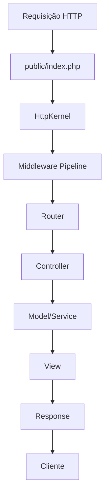

# Fase 2: Sistema HTTP e Roteamento

## Objetivo
Implementar a camada HTTP completa do framework Coyote, incluindo roteamento, controllers, middlewares e sistema de views básico.

## Componentes a Implementar

### 1. HTTP Foundation
- **Request**: Manipulação de requisições HTTP
- **Response**: Criação de respostas HTTP
- **HttpKernel**: Núcleo HTTP que orquestra o fluxo

### 2. Routing System
- **Router**: Gerenciador principal de rotas
- **Route**: Definição individual de rota
- **RouteCollection**: Coleção de rotas
- **RouteServiceProvider**: Provedor de serviço para rotas

### 3. Middleware System
- **MiddlewarePipeline**: Pipeline de execução de middlewares
- **MiddlewareInterface**: Interface para middlewares
- **MiddlewareStack**: Pilha de middlewares

### 4. Controllers
- **Controller**: Classe base para controllers
- **RestController**: Classe base para APIs REST
- **ControllerDispatcher**: Despachador de controllers

### 5. Views System (Básico)
- **View**: Classe para renderização de views
- **ViewFactory**: Fábrica de views
- **TemplateEngine**: Motor de templates básico

## Fluxo de Requisição



## Estrutura de Arquivos

```
vendors/coyote/Http/
├── Request.php
├── Response.php
├── Kernel.php
├── Middleware/
│   ├── MiddlewareInterface.php
│   ├── MiddlewarePipeline.php
│   ├── MiddlewareStack.php
│   └── VerifyCsrfToken.php
├── Controllers/
│   ├── Controller.php
│   ├── RestController.php
│   └── ControllerDispatcher.php
└── Views/
    ├── View.php
    ├── ViewFactory.php
    └── TemplateEngine.php

vendors/coyote/Routing/
├── Router.php
├── Route.php
├── RouteCollection.php
└── RouteServiceProvider.php

app/
├── Controllers/
│   └── HomeController.php
├── Middleware/
│   └── ExampleMiddleware.php
└── Views/
    └── home.php

routes/
├── web.php
└── api.php
```

## Implementação Detalhada

### 1. Request Class
- Baseada em PSR-7 (simplificada)
- Métodos para acesso a headers, query params, body
- Suporte a upload de arquivos
- Métodos helpers (isAjax, wantsJson, etc.)

### 2. Response Class
- Baseada em PSR-7 (simplificada)
- Suporte a diferentes tipos de conteúdo (HTML, JSON, XML)
- Métodos para cookies, redirecionamentos
- Headers HTTP

### 3. Router System
- Suporte a rotas nomeadas
- Parâmetros de rota com validação
- Grupos de rotas com prefixos e middlewares
- Cache de rotas para produção
- Rotas de recursos (RESTful)

### 4. Middleware Pipeline
- Execução sequencial de middlewares
- Passagem de Request através da pipeline
- Interrupção da pipeline quando necessário
- Middlewares globais e de rota

### 5. Controller System
- Injeção de dependências em controllers
- Métodos helpers para responses
- Suporte a dependency injection
- Binding automático de parâmetros de rota

### 6. View System (Básico)
- Renderização de templates PHP simples
- Passagem de dados para views
- Layouts e sections
- Extensível para engines mais complexas

## Exemplos de Uso

### Rotas
```php
// routes/web.php
$router->get('/', 'HomeController@index')->name('home');
$router->get('/about', 'AboutController@index');
$router->get('/users/{id}', 'UserController@show')->where('id', '\d+');

$router->group(['prefix' => 'admin', 'middleware' => 'auth'], function ($router) {
    $router->get('/dashboard', 'AdminController@dashboard');
    $router->resource('posts', 'PostController');
});
```

### Controller
```php
// app/Controllers/HomeController.php
class HomeController extends Controller
{
    public function index(Request $request)
    {
        $data = [
            'title' => 'Welcome to Coyote',
            'users' => User::all(),
        ];
        
        return view('home', $data);
    }
}
```

### Middleware
```php
// app/Middleware/AuthMiddleware.php
class AuthMiddleware implements MiddlewareInterface
{
    public function handle(Request $request, Closure $next)
    {
        if (!Auth::check()) {
            return redirect('/login');
        }
        
        return $next($request);
    }
}
```

## Próximos Passos Após Fase 2

### Fase 3: Database Layer
- Connection Manager
- Query Builder
- Model ORM básico
- Migrations

### Fase 4: Authentication & Validation
- Sistema de autenticação
- Validação de dados
- Form builder

### Fase 5: Advanced Features
- Cache system
- CLI commands
- Module system
- API resources

## Cronograma Estimado
- **Dia 1-2**: Request/Response e HttpKernel
- **Dia 3-4**: Sistema de roteamento completo
- **Dia 5**: Middleware system
- **Dia 6**: Controllers base
- **Dia 7**: Views básico
- **Dia 8**: Testes e integração

## Considerações de Performance
- Cache de rotas em produção
- Lazy loading de services
- Otimização de middleware pipeline
- Compilação de views