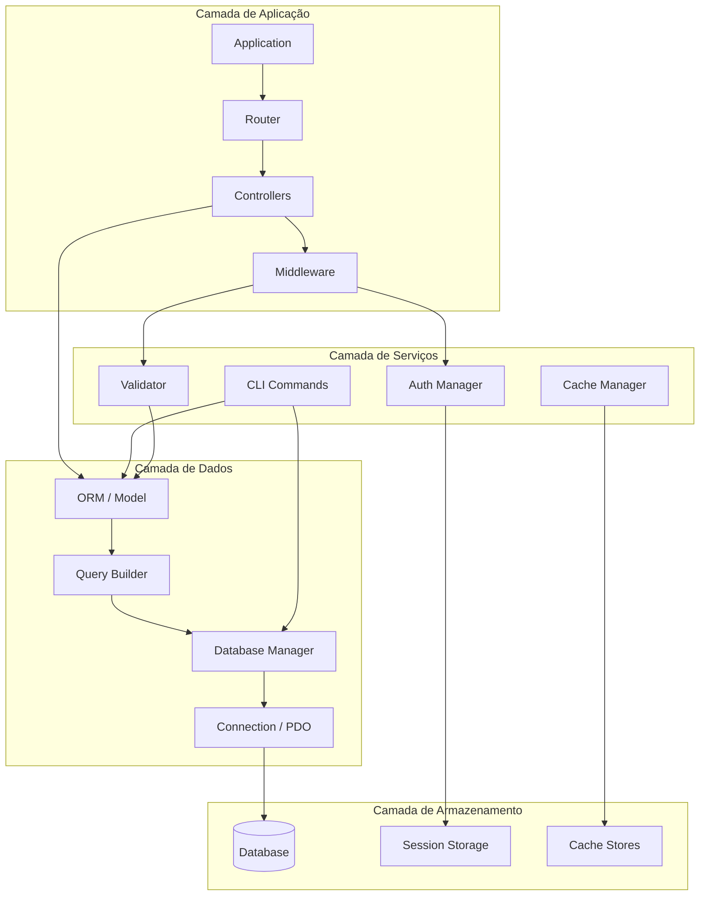
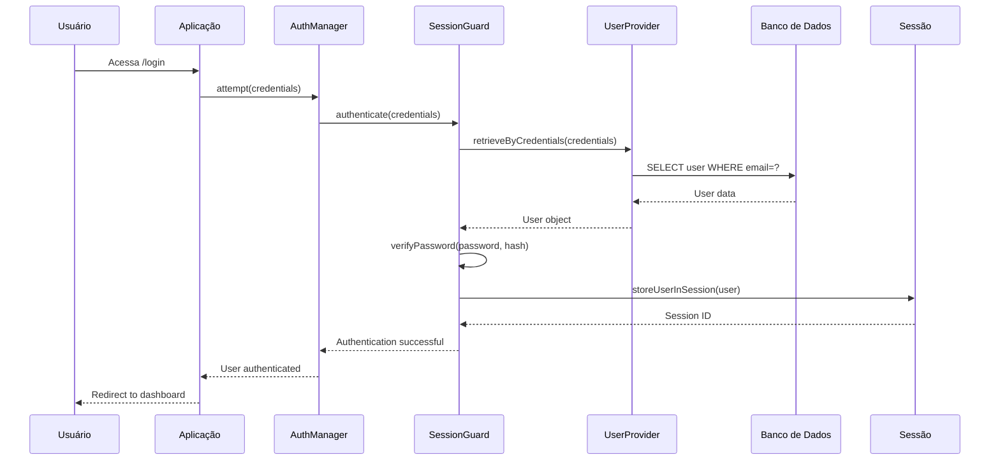
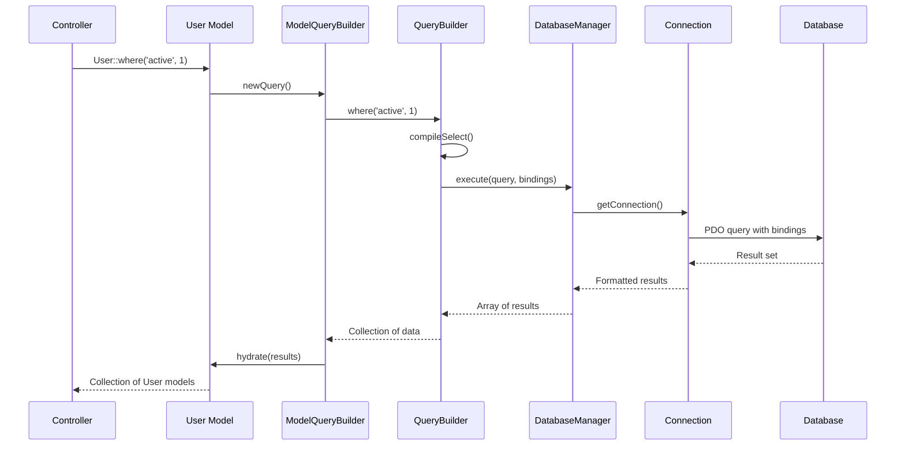
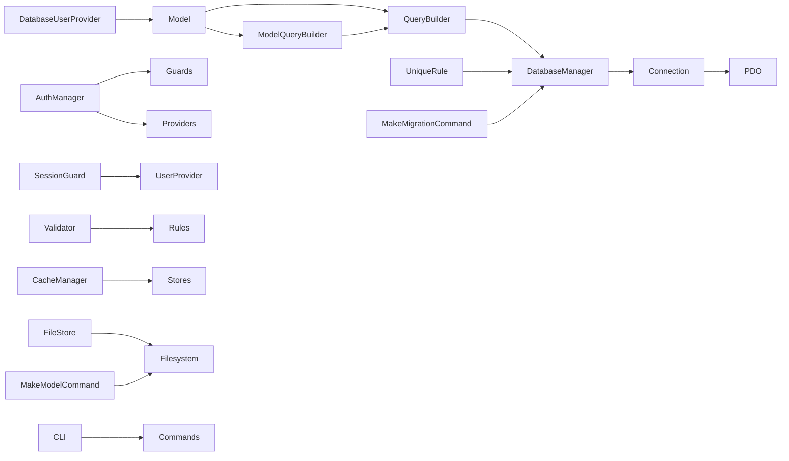

# Diagrama de Arquitetura - Fase 3

## Visão Geral do Sistema



## Fluxo de Autenticação



## Fluxo de Query ORM



## Estrutura de Diretórios da Fase 3

```
coyote/
├── vendors/coyote/
│   ├── Database/
│   │   ├── Model.php
│   │   ├── ModelCollection.php
│   │   ├── ModelQueryBuilder.php
│   │   ├── Relations/
│   │   │   ├── Relation.php
│   │   │   ├── HasOne.php
│   │   │   ├── HasMany.php
│   │   │   ├── BelongsTo.php
│   │   │   └── BelongsToMany.php
│   │   ├── QueryBuilder.php (completo)
│   │   ├── DatabaseManager.php
│   │   └── Connection.php
│   │
│   ├── Auth/
│   │   ├── AuthManager.php
│   │   ├── Contracts/
│   │   │   ├── Authenticatable.php
│   │   │   └── UserProvider.php
│   │   ├── Guards/
│   │   │   ├── Guard.php
│   │   │   ├── SessionGuard.php
│   │   │   └── TokenGuard.php
│   │   ├── Providers/
│   │   │   ├── UserProvider.php
│   │   │   └── DatabaseUserProvider.php
│   │   └── Middleware/
│   │       ├── Authenticate.php
│   │       ├── RedirectIfAuthenticated.php
│   │       └── Authorize.php
│   │
│   ├── Validation/
│   │   ├── Validator.php
│   │   ├── Rule.php
│   │   ├── ValidationException.php
│   │   └── Rules/
│   │       ├── Required.php
│   │       ├── Email.php
│   │       ├── Min.php
│   │       ├── Max.php
│   │       ├── Unique.php
│   │       └── ...
│   │
│   ├── Cache/
│   │   ├── CacheManager.php
│   │   ├── Repository.php
│   │   └── Stores/
│   │       ├── Store.php
│   │       ├── FileStore.php
│   │       ├── DatabaseStore.php
│   │       ├── ArrayStore.php
│   │       └── RedisStore.php
│   │
│   └── Cli/
│       ├── Kernel.php
│       ├── Commands/
│       │   ├── MakeModelCommand.php
│       │   ├── MakeMigrationCommand.php
│       │   ├── MigrateCommand.php
│       │   ├── MakeControllerCommand.php
│       │   └── MakeAuthCommand.php
│       └── Command.php
│
├── app/
│   ├── Models/
│   │   └── User.php
│   ├── Controllers/
│   │   └── AuthController.php
│   └── Middleware/
│
├── config/
│   ├── auth.php
│   ├── database.php
│   └── cache.php
│
├── database/
│   ├── migrations/
│   └── seeds/
│
└── tests/
    ├── Database/
    ├── Auth/
    ├── Validation/
    └── Cache/
```

## Dependências entre Componentes



## Sequência de Implementação Recomendada

1. **QueryBuilder** → **DatabaseManager** → **Connection** (Base de dados)
2. **Model** → **ModelQueryBuilder** → **Relations** (ORM básico)
3. **Auth Contracts** → **UserProvider** → **SessionGuard** → **AuthManager** (Autenticação)
4. **Validator** → **Rules** (Validação)
5. **Cache Stores** → **CacheManager** (Cache)
6. **CLI Commands** → **CLI Kernel** (Interface de linha de comando)
7. **Integração** → **Testes** → **Documentação**

## Considerações de Performance

1. **QueryBuilder**: Usar prepared statements para segurança
2. **ORM**: Implementar eager loading para evitar N+1 queries
3. **Cache**: Cache de queries frequentes
4. **Session**: Session driver otimizado
5. **Validation**: Validação early exit para melhor performance

## Considerações de Segurança

1. **SQL Injection**: Usar bindings em todas as queries
2. **XSS**: Escape automático de output nas views
3. **CSRF**: Tokens em formulários
4. **Authentication**: Hash de senhas (bcrypt/argon2)
5. **Session**: Regeneração de session ID após login
6. **Validation**: Validação de input em todos os endpoints

## Próximos Passos Imediatos

1. Completar método `compileSelect()` no QueryBuilder
2. Implementar métodos `compileInsert()`, `compileUpdate()`, `compileDelete()`
3. Criar classe base `Model` com operações CRUD
4. Implementar `AuthManager` com suporte a sessões
5. Criar comandos CLI básicos (`make:model`, `make:migration`)

Este diagrama fornece uma visão clara da arquitetura da Fase 3 e serve como guia para a implementação.