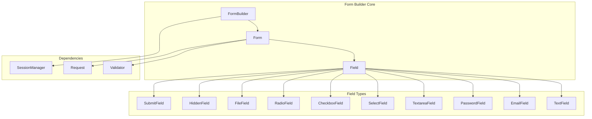
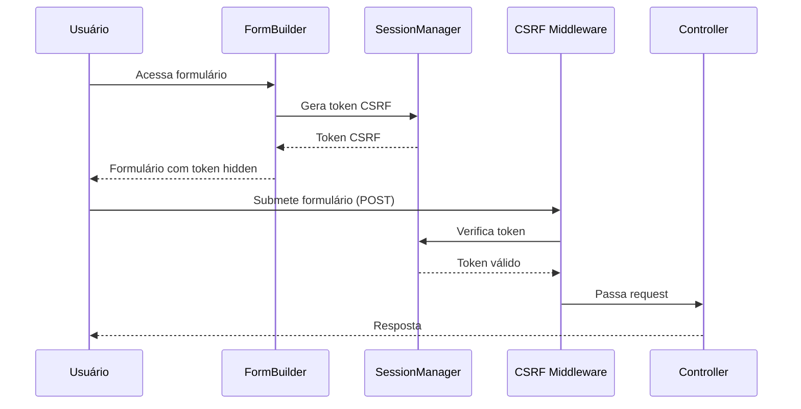
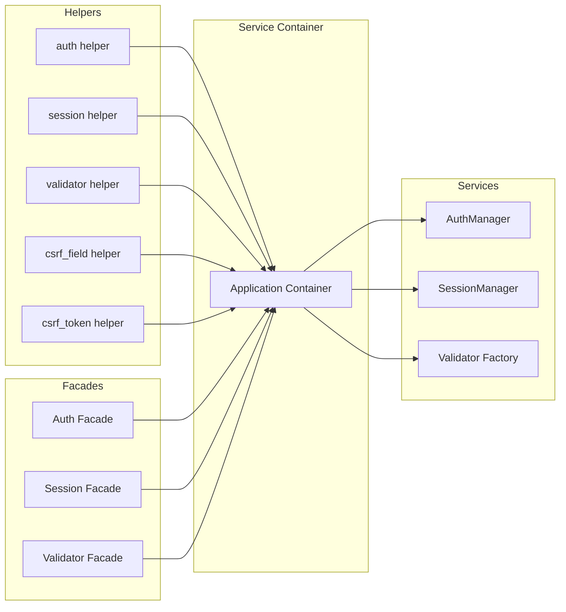

# Próximos Passos - Fase 4D (Form Builder & Integração Final)

## 📊 Status Atual da Fase 4

### ✅ **COMPLETO (100%)**
1. **Session Management** - SessionManager, FileSessionHandler, DatabaseSessionHandler
2. **Password Utilities** - PasswordHasher, PasswordBroker, Remember Me
3. **Validation System** - Validator, 15+ regras, MessageBag, ValidationException, FormRequest

### 🔄 **PRÓXIMOS (FASE 4D - 0%)**
1. **Form Builder Core** - Construção programática de formulários
2. **CSRF Protection** - Proteção contra Cross-Site Request Forgery
3. **Helpers & Facades** - Funções helper e facades para acesso fácil
4. **Integração Final** - Testes e exemplo completo

## 🏗️ Arquitetura dos Próximos Componentes

### 1. Form Builder System



### 2. CSRF Protection Flow



### 3. Helpers & Facades Architecture



## 📋 Plano de Implementação Detalhado

### Etapa 1: Form Builder Core (2-3 dias)

#### 1.1 Estrutura de Diretórios
```
vendors/coyote/Forms/
├── FormBuilder.php          # Classe principal
├── Form.php                # Instância de formulário
├── Field.php               # Classe base de campo
├── Fields/                 # Tipos de campo
│   ├── TextField.php
│   ├── EmailField.php
│   ├── PasswordField.php
│   ├── TextareaField.php
│   ├── SelectField.php
│   ├── CheckboxField.php
│   ├── RadioField.php
│   ├── FileField.php
│   ├── HiddenField.php
│   └── SubmitField.php
└── Concerns/               # Traits
    ├── HasValidation.php
    ├── HasAttributes.php
    └── Renderable.php
```

#### 1.2 Classes Principais

**Field.php (Base)**
```php
abstract class Field {
    protected $name;
    protected $type;
    protected $label;
    protected $value;
    protected $attributes = [];
    protected $rules = [];
    protected $errors = [];
    
    abstract public function render(): string;
    public function validate($value): bool;
    public function setAttribute($key, $value): self;
    public function addRule($rule): self;
}
```

**Form.php**
```php
class Form {
    protected $fields = [];
    protected $method = 'POST';
    protected $action = '';
    protected $attributes = [];
    protected $csrfToken = null;
    
    public function add(Field $field): self;
    public function render(): string;
    public function validate(array $data): bool;
    public function errors(): array;
    public function old($key, $default = null);
}
```

**FormBuilder.php**
```php
class FormBuilder {
    protected $session;
    protected $request;
    
    public function make($action = '', $method = 'POST'): Form;
    public function text($name, $label = ''): TextField;
    public function email($name, $label = ''): EmailField;
    public function password($name, $label = ''): PasswordField;
    // ... outros métodos factory
}
```

### Etapa 2: CSRF Protection (1-2 dias)

#### 2.1 Componentes CSRF
- **CsrfService**: Geração e validação de tokens
- **CsrfMiddleware**: Verificação automática em requests POST/PUT/PATCH/DELETE
- **Configuração**: `config/csrf.php` com opções

#### 2.2 Integração com FormBuilder
- Token CSRF automático em todos os formulários
- Field `HiddenField` para token CSRF
- Validação no backend via middleware

### Etapa 3: Helpers & Facades (1-2 dias)

#### 3.1 Helpers Globais
```php
// helpers.php
function auth($guard = null): AuthManager;
function session($key = null, $default = null);
function validator(array $data, array $rules, array $messages = []): Validator;
function csrf_field(): string;
function csrf_token(): string;
function old($key, $default = null);
```

#### 3.2 Facades
```php
// Auth Facade
class Auth extends Facade {
    protected static function getFacadeAccessor() { return 'auth'; }
}

// Session Facade  
class Session extends Facade {
    protected static function getFacadeAccessor() { return 'session'; }
}

// Validator Facade
class Validator extends Facade {
    protected static function getFacadeAccessor() { return 'validator'; }
}
```

### Etapa 4: Integração Final (2-3 dias)

#### 4.1 Testes de Integração
- Fluxo completo: Registro → Login → Dashboard
- Validação de formulários com erro e sucesso
- CSRF protection funcionando
- Session persistence entre requests
- Password reset flow

#### 4.2 Exemplo Completo de Aplicação
- Controller com FormRequest validation
- Views com FormBuilder e helpers
- Middleware de autenticação
- Rotas completas com auth

## 🔗 Dependências entre Componentes

```
SessionManager (✅)
    ↓
FormBuilder (gera tokens CSRF)
    ↓
CSRF Middleware (valida tokens)
    ↓  
Validator (✅) ← FormBuilder (validação)
    ↓
Helpers & Facades (acesso fácil)
    ↓
Integração Final (testes + exemplo)
```

## 🎯 Critérios de Aceitação

### Para Form Builder:
- [ ] 10+ tipos de campos implementados
- [ ] Renderização HTML correta
- [ ] Integração com Validator para validação
- [ ] Suporte a old input (valores anteriores)
- [ ] CSRF token automático

### Para CSRF Protection:
- [ ] Tokens únicos por sessão
- [ ] Validação automática via middleware
- [ ] Proteção para POST/PUT/PATCH/DELETE
- [ ] Integração com FormBuilder

### Para Helpers & Facades:
- [ ] Helpers globais funcionando
- [ ] Facades para Auth, Session, Validator
- [ ] Integração com Service Container
- [ ] Documentação de uso

### Para Integração Final:
- [ ] Fluxo completo de auth testado
- [ ] Exemplo de aplicação funcionando
- [ ] Testes de integração passando
- [ ] Documentação completa

## ⚠️ Riscos e Mitigação

### Riscos:
1. **Complexidade do FormBuilder** - Pode levar mais tempo
2. **Integração CSRF com Session** - Possíveis conflitos
3. **Compatibilidade com código existente** - Helpers podem conflitar

### Mitigação:
1. Começar com FormBuilder simples (apenas text, email, password)
2. Testar CSRF incrementalmente
3. Usar namespaces únicos para helpers

## 📅 Cronograma Estimado

- **Dia 1-3**: Form Builder Core
- **Dia 4-5**: CSRF Protection  
- **Dia 6-7**: Helpers & Facades
- **Dia 8-10**: Integração Final & Testes

**Total**: 10 dias (2 semanas) de trabalho

## 🚀 Próximas Ações Imediatas

1. **Criar estrutura de diretórios** do Form Builder
2. **Implementar Field base class** e 3-4 tipos básicos
3. **Testar integração** com Validator existente
4. **Criar exemplo simples** de uso

---

**Status**: 📋 Plano de implementação da Fase 4D criado - Pronto para começar

**Próxima Ação**: Criar estrutura do Form Builder e implementar classes base